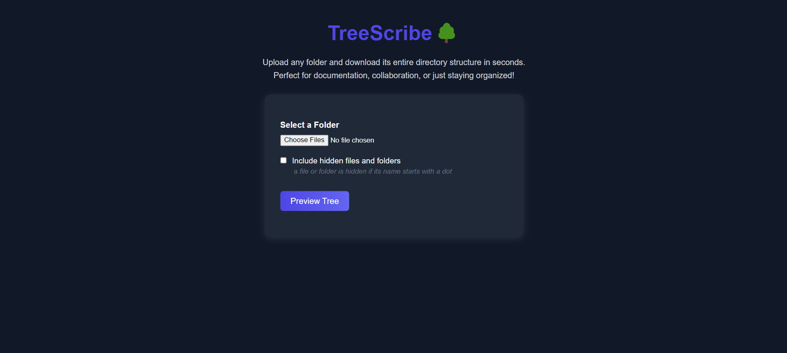
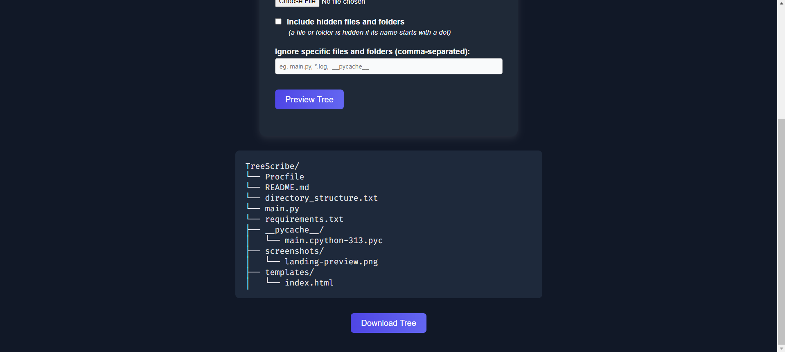

# TreeScribe🌳

## Table of Contents
<dev align="center">
    <table align="center">
        <tr>
            <td><a href="#introduction">Introduction</a></td>        
            <td><a href="#features">Features</a></td>
            <td><a href="#screenshots">Screenshots</a></td>
            <td><a href="#why-this-app">Why This App?</a></td>
            <td><a href="#technologies-used">Technologies Used</a></td>
            <td><a href="#deployment--production-notes">Deployment & Production Notes</a></td>
            <td><a href="#local-developement">Local Developement</a></td>
        </tr>
        <tr>
            <td><a href="#future-improvements">Future Improvements</a></td>
        </tr>
        <tr>
            <td><a href="#feedback">Feedback</a></td>
            <td><a href="#contact">Contact</a></td>
        </tr>
    </table>
</dev>

<p align="right"><a href="#introduction">back to top ⬆️</a></p>

---

## Introduction

> Visualize your folder’s DNA — *instantly*. [Try the Live Web Application](https://web-production-7ebec6.up.railway.app/)

**TreeScribe** is a simple web app that lets you upload any directory or zip file and instantly generate a clean, text-based representation of its folder structure. You can preview it in your browser and download the result as a `.txt` file. It’s especially useful for developers, writers, and teams that want to document project structures or maintain consistent folder organization.

---

## Features

- Upload a directory or zip file to automatically generate a `tree`-style folder structure
- Toggle inclusion of hidden files and folders
- Input specific file/folder names to ignore (e.g., `node_modules, dist, __pycache__`)
- Automatically block uploads with too many files (to avoid browser or server overload)
- Live preview of the directory tree before download
- Notify user of long path errors
- Export as `.txt` with a single click

---

## Screenshots

|  |
|:--:|
| *Landing page showing upload and customization options* |

|  |
|:--:|
| *Landing page showing directory preview and export options* |

---

## Why This App?

Directory trees are essential in documentation, especially for open-source projects, backend systems, and static site generators. But most tools for generating them are CLI-based or require extra setup. TreeScribe makes it dead simple: no installs, no config, no terminal — just upload and go.

---

## Technologies Used

- **Backend**: Python, FastAPI, Jinja2
- **Frontend**: Vanilla HTML, CSS, JavaScript
- **Styling**: Custom CSS (dark theme)
- **Deployment**: Railway (Backend), Vercel (optional frontend deployment)

---

## Deployment & Production Notes

- **Platform**: [Railway](https://railway.app)
- **Requirements**: 
  ```
  fastapi
  uvicorn
  jinja2
  python-multipart
  ```
- **Procfile**:
  ```bash
  web: uvicorn main:app --host 0.0.0.0 --port $PORT
  ```

## Local Developement
  ```
  python -m uvicorn main:app --reload
  ```

## Future Improvements
- Add ability to download .md or .html versions
- Visual (graph-based) folder map rendering
- Drag-and-drop folder upload
- Add cloud drive integrations (Google Drive, Dropbox)
- File search and filter support

## Feedback
Open an issue or suggestion on GitHub — feedback is welcome!

## Contact
Mohammad Nusairat — mnusairat2003@gmail.com

<p align="right"><a href="#introduction">back to top ⬆️</a></p>