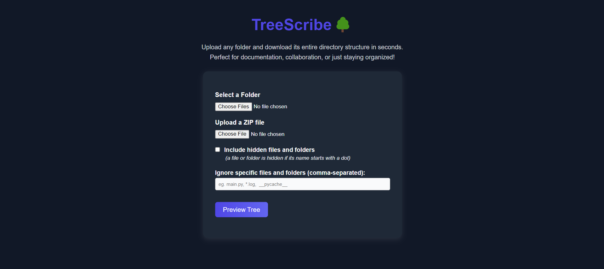

# 🌳 TreeScribe

## Table of Contents
<dev align="center">
    <table align="center">
        <tr>
            <td><a href="#introduction">Introduction</a></td>        
            <td><a href="#features">Features</a></td>
            <td><a href="#screenshots">Screenshots</a></td>
            <td><a href="#why-this-app">Why This App?</a></td>
            <td><a href="#technologies-used">Technologies Used</a></td>
            <td><a href="#deployment--production-notes">Deployment & Production Notes</a></td>
        </tr>
        <tr>
            <td><a href="#setup-instructions">Setup Instructions</a></td>
            <td><a href="#how-to-use-the-app">How to Use the App</a></td>
            <td><a href="#future-improvements">Future Improvements</a></td>
        </tr>
        <tr>
            <td><a href="#feedback">Feedback</a></td>
            <td><a href="#contact">Contact</a></td>
        </tr>
    </table>
</dev>

<p align="right"><a href="#introduction">back to top ⬆️</a></p>

---

## Introduction

**TreeScribe** is a simple web app that lets you upload any directory and instantly generate a clean, text-based representation of its folder structure. You can preview it in your browser and download the result as a `.txt` file. It’s especially useful for developers, writers, and teams that want to document project structures or maintain consistent folder organization.

> "Visualize your folder’s DNA — instantly."

---

## Features

- Upload a directory via drag-and-drop or file picker
- Automatically generate a `tree`-style folder structure
- Toggle inclusion of hidden files and folders
- Live preview of the directory tree before download
- Export as `.txt` with a single click
- Dark mode theme (enabled by default for a modern look)
- Built-in descriptions to guide new users

---

## Screenshots

|  |
|:--:|
| *Landing page showing directory preview and export options* |

---

## Why This App?

Directory trees are essential in documentation, especially for open-source projects, backend systems, and static site generators. But most tools for generating them are CLI-based or require extra setup. TreeScribe makes it dead simple: no installs, no config, no terminal — just upload and go.

---

## Technologies Used

- **Backend**: Python, FastAPI, Jinja2
- **Frontend**: Vanilla HTML, CSS, JavaScript
- **Styling**: Custom CSS (dark theme)
- **Deployment**: Railway (Backend), Vercel (optional frontend deployment)

---

## Deployment & Production Notes

### Backend Deployment

- **Platform**: [Railway](https://railway.app)
- **Startup Command**:  
  ```bash
  uvicorn main:app --host 0.0.0.0 --port $PORT
  ```
- **Requirements**: Defined in requirements.txt
- **Procfile**:
  ```bash
  web: uvicorn main:app --host 0.0.0.0 --port $PORT
  ```